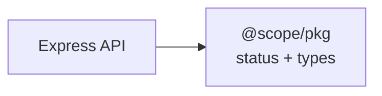

# Mermaid Doc Guard

Validate Mermaid diagrams and apply syntax-safe patterns to prevent parser failures.

## Workflow

1. Run Mermaid validation for the docs path.

```bash
CODEX_HOME="${CODEX_HOME:-$HOME/.codex}"
node "$CODEX_HOME/skills/mermaid-doc-guard/scripts/validate-mermaid.mjs" docs
```

2. If validation fails, fix the reported Mermaid block in the referenced file.

3. Apply safe Mermaid authoring patterns:
- Use explicit node IDs with quoted labels: `id["Label"]`.
- Quote labels that include special characters such as `@`, `/`, `:`, `{}`, `[]`, `<`, `>`.
- Prefer `<br/>` instead of `\n` inside labels for renderer compatibility.
- Keep edge labels quoted when they include punctuation.

4. Re-run validation until all diagrams pass.

```bash
CODEX_HOME="${CODEX_HOME:-$HOME/.codex}"
node "$CODEX_HOME/skills/mermaid-doc-guard/scripts/validate-mermaid.mjs" docs
```

## Common Repair Pattern

- Before:
```mermaid
flowchart LR
  API --> Shared[@scope/pkg\nstatus + types]
```

- After:


See `references/mermaid-safe-patterns.md` for additional patterns.
