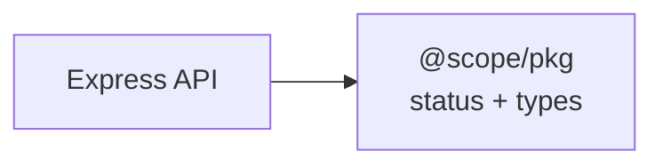

# Mermaid Doc Guard

Validate Mermaid diagrams with a real Mermaid renderer, repair only genuine diagram failures, and preserve the author's diagram semantics.

## Workflow

1. Choose the narrowest useful validation scope.
   - When editing one or more Markdown files, pass those files directly.
   - When checking a documentation directory, pass that directory.
   - When checking the whole repository, omit targets; the validator scans the current repository.

2. Run validation.

```bash
CODEX_HOME="${CODEX_HOME:-$HOME/.codex}"
node "$CODEX_HOME/skills/mermaid-doc-guard/scripts/validate-mermaid.mjs" docs/technical/ARCHITECTURE.md docs
```

3. Interpret the exit code before changing anything.
   - `0`: validation passed, or no Mermaid blocks were present in the selected Markdown files.
   - `1`: a Mermaid block failed to parse/render, or a Mermaid fence violates the guard policy. Repair only the reported block.
   - `2`: the renderer/tooling environment failed. Fix Node, npm/npx, mmdc, Puppeteer/Chromium, network, permission, timeout, or sandbox problems. Do **not** modify Mermaid source to compensate.
   - `3`: the invocation or target path is invalid. Correct the command or target.

4. For exit code `1`, make the smallest syntax-safe repair that preserves diagram type, direction, topology, labels, and intended meaning. Do not redesign or simplify a diagram merely to make it pass.

5. Re-run the same validation command until it exits `0`.

## Safe Authoring Rules

- Prefer explicit node IDs with quoted flowchart labels: `id["Label"]`.
- Quote flowchart labels containing punctuation or syntax-significant characters.
- Prefer `<br/>` instead of raw `\n` inside flowchart labels for renderer compatibility.
- Keep edge labels quoted when punctuation makes parsing ambiguous.
- Use an explicit closing fence for every Mermaid block. The validator intentionally treats an unclosed Mermaid fence as a guard failure even though some Markdown parsers accept EOF-terminated fences.
- Do not apply flowchart-specific quoting rules blindly to sequence, state, class, or ER diagrams; use syntax appropriate to the diagram type.

## Common Repair Pattern

Before (shown as text because it is intentionally unsafe Mermaid):

````text
```mermaid
flowchart LR
  API --> Shared[@scope/pkg\nstatus + types]
```
````

After:


```mermaid
flowchart LR
  api["Express API"] --> shared["@scope/pkg<br/>status + types"]
```

See `references/mermaid-safe-patterns.md` for repair guidance and renderer notes.
