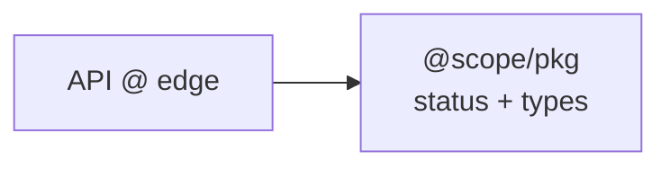
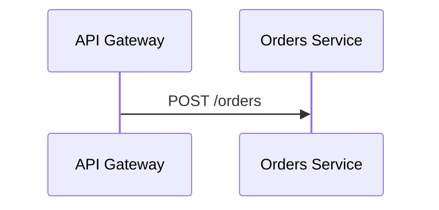
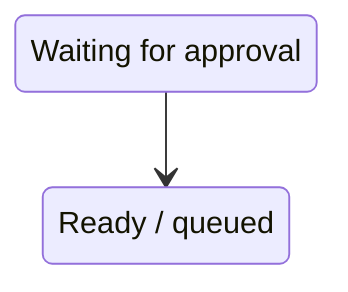

# Mermaid Safe Patterns

Use these patterns only when they preserve the diagram's intended meaning. The renderer error is authoritative; avoid broad rewrites when a small syntax repair is enough.

## Common rules

- Preserve diagram type, direction, topology, labels, and relationships unless the broken syntax itself requires a change.
- Keep node/participant/state identifiers simple and stable when display text contains punctuation.
- Prefer an explicit closing Markdown fence for every Mermaid block.
- Validate again after every repair.

## Flowchart

Prefer explicit IDs and quoted labels when text contains punctuation or Mermaid-significant characters:



Useful practices:

- Prefer `node_id["Text"]` over bare `node_id[Text]` when labels contain punctuation.
- Prefer `<br/>` for deliberate line breaks in labels.
- Quote edge labels when punctuation makes the edge syntax ambiguous.
- Avoid using lowercase `end` as an unquoted flowchart node label; use a different ID and a quoted display label instead.
- Be careful with node IDs immediately following edge syntax when an `o` or `x` could be interpreted as a circle or cross edge marker; add spacing or use an explicit node form.

## Sequence diagrams

Do not translate flowchart node syntax into a sequence diagram. Keep participant IDs separate from human-facing aliases when names contain punctuation or spaces:



If a message or alias triggers a parser error, repair that sequence-diagram construct directly instead of converting the diagram to a flowchart.

## State diagrams

Use explicit state aliases when display text is complex:



Keep transition structure unchanged while repairing labels or aliases.

## Class and ER diagrams

Class and ER diagrams have syntax that differs materially from flowcharts. Do not wrap class/entity declarations in flowchart brackets merely because a label contains punctuation. Prefer simple identifiers, supported aliases/comments, and the smallest change indicated by the Mermaid parser.

## Renderer compatibility

The validator uses a repository-local `mmdc` when one exists at `node_modules/.bin/mmdc`. Otherwise it falls back to a pinned Mermaid CLI version (`11.16.0` by default) through `npx`.

Override the fallback version when a repository intentionally targets another renderer:

```bash
MERMAID_CLI_VERSION=11.16.0 node validate-mermaid.mjs docs
```

A successful render with one Mermaid version does not guarantee identical behavior in every hosting platform. When the target is GitHub, GitLab, a docs framework, or another embedded renderer, align validation with that platform's supported Mermaid version when known.

## Validation commands

Whole repository:

```bash
CODEX_HOME="${CODEX_HOME:-$HOME/.codex}"
node "$CODEX_HOME/skills/mermaid-doc-guard/scripts/validate-mermaid.mjs"
```

Multiple targets:

```bash
CODEX_HOME="${CODEX_HOME:-$HOME/.codex}"
node "$CODEX_HOME/skills/mermaid-doc-guard/scripts/validate-mermaid.mjs" README.md docs architecture
```

Custom renderer timeout:

```bash
MERMAID_TIMEOUT_MS=60000 node validate-mermaid.mjs docs
```
